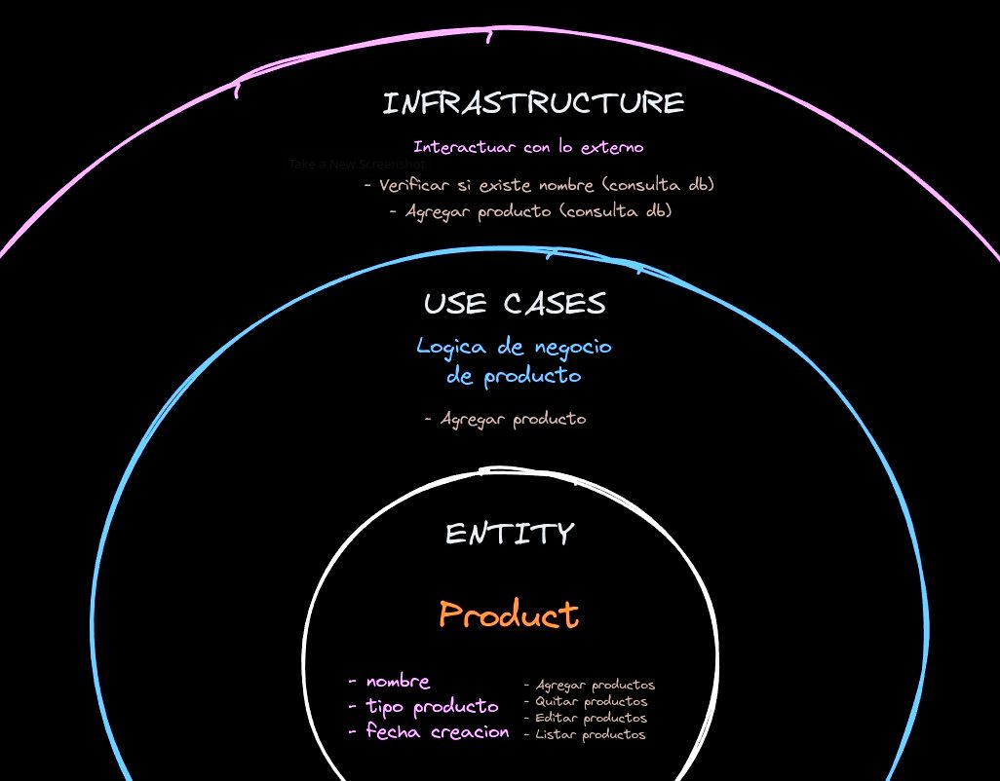

# Microservice for AUTH service with Clean Architecture


## Advantages
- **Maintainability**: Facilita la actualización o modificación del código sin afectar otras capas.
- **Framework independence**: La lógica de negocio está desacoplada de los frameworks específicos.
- **Testability**: Fomenta un diseño que facilita las pruebas unitarias e integradas.
- **Scalability**: Soporta el crecimiento de la aplicación de manera estructurada y organizada.
- **Separation of concerns**: Divide claramente las responsabilidades entre la lógica de negocio, la presentación y las capas de datos.

## Disadvantages
- **Initial complexity**: Requiere más esfuerzo y conocimiento para configurarse y entenderse, especialmente en proyectos más pequeños.
- **Abstraction overhead**: La separación estricta de capas puede llevar a abstracciones innecesarias, dificultando la comprensión del código.
- **Learning curve**: Puede ser un desafío para los desarrolladores nuevos o que no están familiarizados con arquitecturas complejas.
- **Slower development**: Puede ralentizar el desarrollo al principio debido a la necesidad de una correcta estructuración del código.
- **Over-engineering**: Para proyectos pequeños o simples, puede parecer una solución excesiva y innecesaria.

## Layers
- **Domain**: Esta capa contiene las entidades centrales de la aplicación, así como las definiciones (interfaces) para los repositorios y casos de uso. Representa la lógica de negocio y las reglas.

- **Infrastructure**: Esta capa proporciona la implementación de las interfaces de los repositorios definidas en la capa de dominio. Maneja la interacción real con sistemas externos como bases de datos, APIs y otros servicios.

- **Use Case**: Esta capa contiene la implementación de las interfaces de los casos de uso definidas en la capa de dominio. Orquesta la lógica de negocio y coordina entre las capas de dominio e infraestructura.

- **Interface**: Esta capa es implícita y representa los puntos de entrada externos, como controladores, APIs o interfaces de usuario, que interactúan con las capas subyacentes.



## Tools
- Go 1.22.2
- Gin 1.9.1
- MySQL
- Docker
- GitHub Actions
- Automapper

## Install
- Run makefile 
  ```script
  make generate_db_mysql
  ```
- Or run docker compose
  ```script
  docker-compose up -d
  ```
- Environment variables
  ```script
  DB_DATABASE=gymbro_db;
  DB_HOST=127.0.0.1;
  DB_PASSWORD=erp_password;
  DB_PORT=3307;
  DB_USERNAME=erp_user;
  JWT_SECRET=QzH9cSA1vrP4mSSp;
  SERVER_PORT=9001
  ```